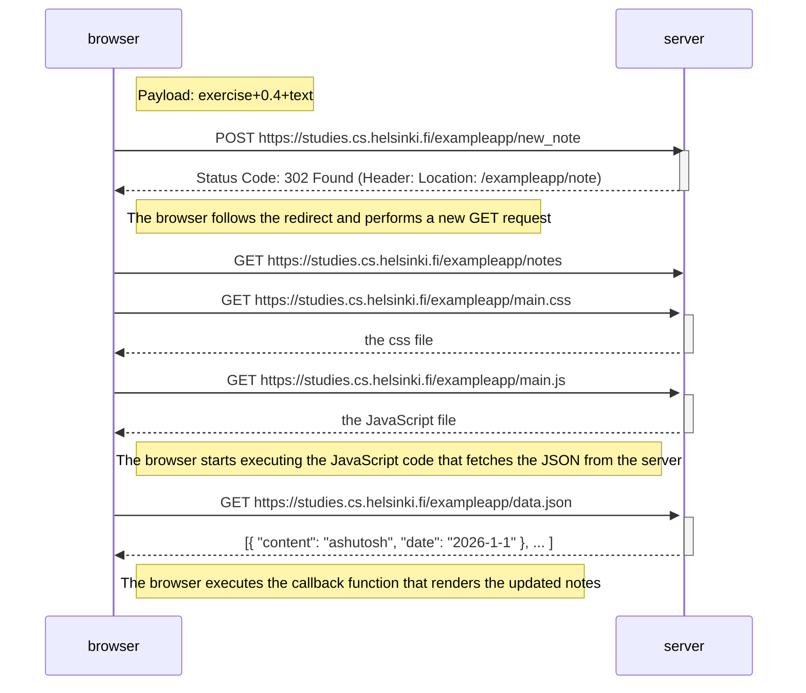

here's the sequence diagram for exercise0.4

```mermaid

sequenceDiagram
    participant browser
    participant server


    Note right of browser:  Payload: exercise+0.4+text
    browser->>server: POST https://studies.cs.helsinki.fi/exampleapp/new_note
    activate server 
    server-->>browser: Status Code: 302 Found (Header: Location: /exampleapp/note)
    deactivate server
    Note right of browser: The browser follows the redirect and performs a new GET request

    browser->>server: GET https://studies.cs.helsinki.fi/exampleapp/notes
    activate server    
    browser->>server: GET https://studies.cs.helsinki.fi/exampleapp/main.css
    activate server
    server-->>browser: the css file
    deactivate server

    browser->>server: GET https://studies.cs.helsinki.fi/exampleapp/main.js
    activate server
    server-->>browser: the JavaScript file
    deactivate server

    Note right of browser: The browser starts executing the JavaScript code that fetches the JSON from the server

    browser->>server: GET https://studies.cs.helsinki.fi/exampleapp/data.json
    activate server
    server-->>browser: [{ "content": "ashutosh", "date": "2026-1-1" }, ... ]
    deactivate server

    Note right of browser: The browser executes the callback function that renders the updated notes


```

